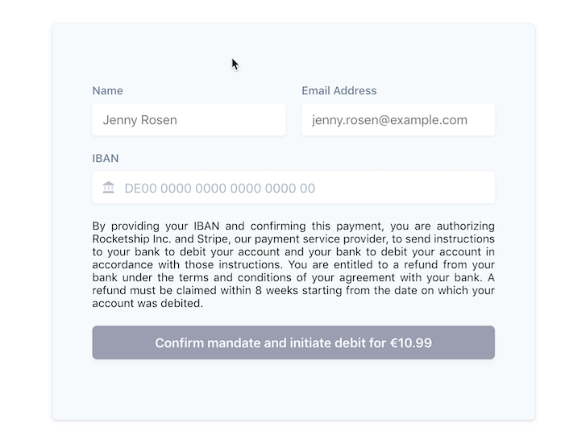

# Collecting a SEPA Debit mandate and payment

Stripe users in Europe and the United States can use the [IBAN Element](https://stripe.com/docs/stripe-js/elements/iban) and PaymentIntents to accept [SEPA Direct Debit payments](https://stripe.com/docs/payments/sepa-debit) from customers within the [Single Euro Payments Area](https://en.wikipedia.org/wiki/Single_Euro_Payments_Area).

During the payment process, [a PaymentIntent object is created](https://stripe.com/docs/payments/sepa-debit#create-paymentintent) and a recurring SEPA Debit mandate is automatically generated and the debit is initiated. SEPA Direct Debit is a pull-based, asynchronous method of payment. It can take up to 14 business days to confirm the success or failure of a payment. [Listen to webhooks](https://stripe.com/docs/payments/sepa-debit#confirm-success) to be notified of payment status changes.

## Demo

<!-- See a [hosted version]() of the sample or fork a copy on [codesandbox.io](). TODO -->

All the samples run in test mode -- use `DE89370400440532013000` for testing successful debits.

Read more about testing on Stripe at https://stripe.com/docs/testing#sepa-direct-debit.



## Webhooks

You will need to handle asynchronous events in order to be notified when the payment is successful or has failed. To do so, it is essential that your integration uses webhooks to monitor the `payment_intent.succeeded` and `payment_intent.payment_failed` events.

<!-- prettier-ignore -->
| This sample shows: | Using webhooks | 
:--- | :---: 
📝 **Formatting and validating customer IBANs** using the [Stripe IBAN Element](https://stripe.com/docs/stripe-js/elements/iban). | ✅ |
🙅 **Automatically generating recurring SEPA Debit mandates** for [future usage](https://stripe.com/docs/payments/sepa-debit-setup-intents) of SEPA Debit payment methods for example with [Stripe Billing](https://stripe.com/docs/billing/subscriptions/set-up-subscription).  | ✅ |
↪️ **Using webhooks to verify the payment outcome.** You will need to handle asynchronous events in order to be notified when the payment is successful or has failed. | ✅ |
🏦 **Easily scalable to other payment methods.** Webhooks enable easy adoption of other asynchroneous payment methods like direct debits and push-based payment flows. | ✅ |

## How to run locally

This sample includes 5 server implementations in Node, Ruby, Python, Java, and PHP.

Follow the steps below to run locally.

**1. Clone and configure the sample**

The Stripe CLI is the fastest way to clone and configure a sample to run locally.

**Using the Stripe CLI**

If you haven't already installed the CLI, follow the [installation steps](https://github.com/stripe/stripe-cli#installation) in the project README. The CLI is useful for cloning samples and locally testing webhooks and Stripe integrations.

In your terminal shell, run the Stripe CLI command to clone the sample:

```
stripe samples create web-elements-sepa-debit-payment
```

The CLI will walk you through picking your integration type, server and client languages, and configuring your .env config file with your Stripe API keys.

**Installing and cloning manually**

If you do not want to use the Stripe CLI, you can manually clone and configure the sample yourself:

```
git clone https://github.com/stripe-samples/web-elements-sepa-debit-payment
```

Copy the .env.example file into a file named .env in the folder of the server you want to use. For example:

```
cp .env.example using-webhooks/server/node/.env
```

You will need a Stripe account in order to run the demo. Once you set up your account, go to the Stripe [developer dashboard](https://stripe.com/docs/development#api-keys) to find your API keys.

```
STRIPE_PUBLISHABLE_KEY=<replace-with-your-publishable-key>
STRIPE_SECRET_KEY=<replace-with-your-secret-key>
```

`STATIC_DIR` tells the server where to the client files are located and does not need to be modified unless you move the server files.

**2. Follow the server instructions on how to run:**

Pick the server language you want and follow the instructions in the server folder README on how to run.

For example, if you want to run the Node server in `using-webhooks`:

```
cd using-webhooks/server/node # there's a README in this folder with instructions
npm install
npm start
```

**4. [Optional] Run a webhook locally:**

If you want to test the `using-webhooks` integration with a local webhook on your machine, you can use the Stripe CLI to easily spin one up.

First [install the CLI](https://stripe.com/docs/stripe-cli) and [link your Stripe account](https://stripe.com/docs/stripe-cli#link-account).

```
stripe listen --forward-to localhost:4242/webhook
```

The CLI will print a webhook secret key to the console. Set `STRIPE_WEBHOOK_SECRET` to this value in your .env file.

You should see events logged in the console where the CLI is running.

When you are ready to create a live webhook endpoint, follow our guide in the docs on [configuring a webhook endpoint in the dashboard](https://stripe.com/docs/webhooks/setup#configure-webhook-settings).

## FAQ

Q: Why did you pick these frameworks?

A: We chose the most minimal framework to convey the key Stripe calls and concepts you need to understand. These demos are meant as an educational tool that helps you roadmap how to integrate Stripe within your own system independent of the framework.

Q: Can you show me how to build X?

A: We are always looking for new sample ideas, please email dev-samples@stripe.com with your suggestion!

## Author(s)

[@thorsten-stripe](https://twitter.com/thorwebdev)
